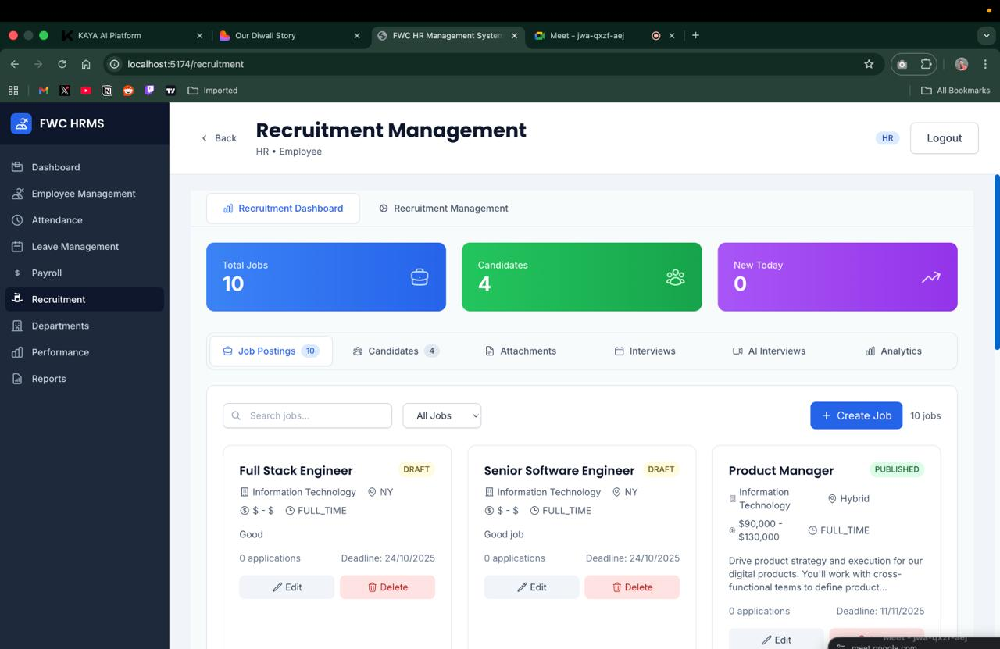
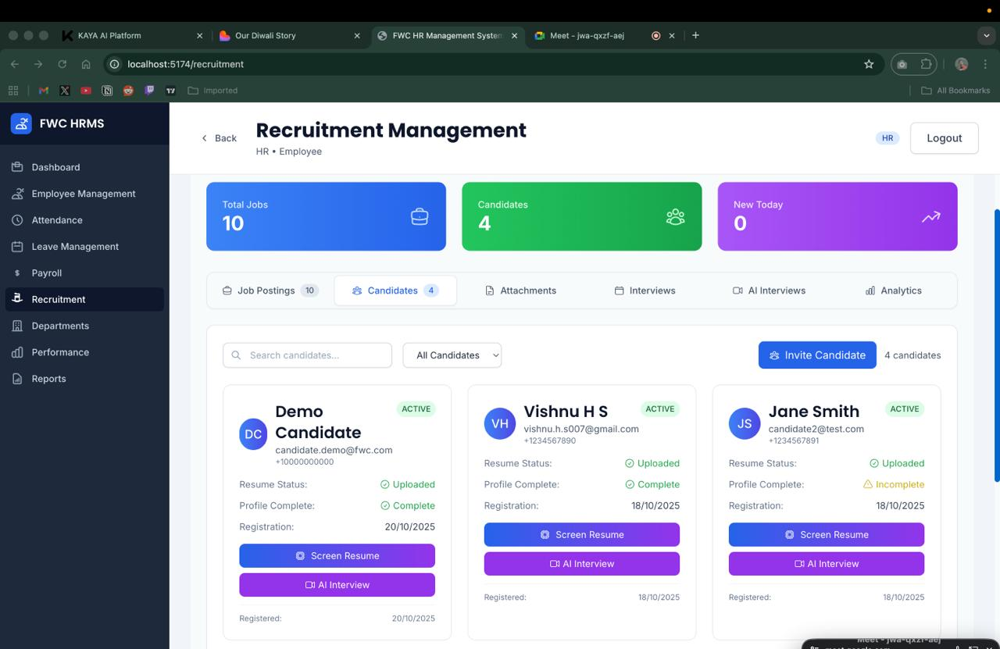
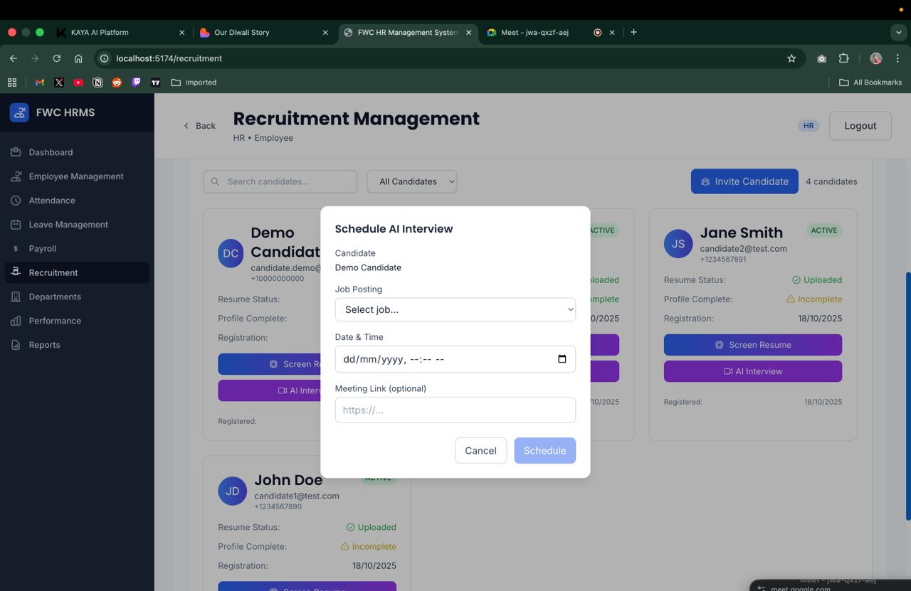

# Mastersolis Infotech - Enterprise-Grade Human Resource Management System

[](https://opensource.org/licenses/MIT)

[](https://nodejs.org/)

[](https://reactjs.org/)

[](https://www.mongodb.com/)

[](https://www.docker.com/)

[](https://github.com/PriyankaGowda2005/CICADA-HACK)

> **🚀 Live Repository**: [https://github.com/PriyankaGowda2005/CICADA-HACK](https://github.com/PriyankaGowda2005/CICADA-HACK)

A comprehensive, production-ready Human Resource Management System built with modern web technologies. Features real-time updates, role-based access control, AI-powered features, and a mobile-responsive design.

## 📋 Table of Contents

- [Screenshots](#-screenshots)
- [Features](#-features)
- [Architecture](#-architecture)
- [Tech Stack](#-tech-stack)
- [Prerequisites](#-prerequisites)
- [Installation](#-installation)
- [Configuration](#-configuration)
- [Usage](#-usage)
- [API Documentation](#-api-documentation)
- [Testing](#-testing)
- [Deployment](#-deployment)
- [Contributing](#-contributing)
- [License](#-license)
- [Support](#-support)

## 📸 Screenshots

### Recruitment Management Interface

The Mastersolis Infotech HRMS provides an intuitive and modern interface for managing recruitment processes. Below are screenshots showcasing the key features:

#### Recruitment Dashboard



_Overview of recruitment metrics including total jobs, candidates, and daily statistics_

#### Candidate Management



_Comprehensive candidate profiles with resume status, profile completion, and action buttons_

#### AI Interview Scheduling



_Modal interface for scheduling AI-powered interviews with candidates_

## ✨ Features

### 🎯 Core HR Features

- **Employee Management** - Complete employee lifecycle management
- **Attendance Tracking** - Real-time clock in/out with GPS tracking
- **Leave Management** - Comprehensive leave request and approval system
- **Payroll Management** - Automated payroll processing and distribution
- **Performance Reviews** - 360-degree performance evaluation system
- **Department Management** - Organizational structure management
- **Reports & Analytics** - Advanced reporting and data visualization

### 🤖 AI-Powered Features

- **Resume Screening** - Automated resume parsing and candidate matching
- **Interview Analysis** - Real-time interview transcription and analysis
- **Emotion Detection** - AI-powered emotion analysis during interviews
- **Chatbot Assistant** - Intelligent HR assistant for common queries
- **Predictive Analytics** - Employee retention and performance predictions

### 🔐 Security & Access Control

- **Role-Based Access Control (RBAC)** - Granular permission system
- **Multi-Factor Authentication** - Enhanced security with MFA
- **JWT Token Management** - Secure authentication with refresh tokens
- **Audit Logging** - Comprehensive activity tracking
- **Data Encryption** - End-to-end data protection

### 📱 Mobile & Responsive Design

- **Progressive Web App (PWA)** - Mobile-first responsive design
- **Cross-Platform Compatibility** - Works on all devices and browsers
- **Offline Support** - Limited functionality when offline
- **Touch-Optimized UI** - Intuitive mobile interface
- **Responsive Components** - Pre-built responsive layout components
- **Mobile Navigation** - Collapsible mobile menu with smooth animations
- **Adaptive Grids** - Responsive grid layouts for all screen sizes

### 🔄 Real-Time Features

- **Live Notifications** - Instant updates across all users
- **Real-Time Collaboration** - Multi-user simultaneous editing
- **Live Dashboard Updates** - Dynamic data visualization
- **WebSocket Integration** - Bidirectional real-time communication

## 🏗️ Architecture

### System Architecture

```
┌─────────────────┐    ┌─────────────────┐    ┌─────────────────┐
│   Frontend      │    │   Backend API   │    │   Database      │
│   (React/Vite)  │◄──►│   (Node.js)     │◄──►│   (MongoDB)     │
└─────────────────┘    └─────────────────┘    └─────────────────┘
         │                       │                       │
         │                       │                       │
┌─────────────────┐    ┌─────────────────┐    ┌─────────────────┐
│   Mobile App    │    │   AI Services   │    │   Redis Cache   │
│   (React Native)│    │   (Python)       │    │   (Sessions)    │
└─────────────────┘    └─────────────────┘    └─────────────────┘
```

### Microservices Architecture

- **Frontend Service** - React-based web application
- **Backend API Service** - Node.js REST API with Socket.IO
- **AI/ML Service** - Python-based machine learning services
- **Mobile Service** - React Native mobile application
- **Database Service** - MongoDB with Redis caching

## 🛠️ Tech Stack

### Frontend

- **React 18** - Modern UI library with hooks
- **Vite** - Fast build tool and development server
- **Tailwind CSS** - Utility-first CSS framework
- **React Router** - Client-side routing
- **TanStack Query** - Server state management
- **Socket.IO Client** - Real-time communication
- **Framer Motion** - Animation library
- **React Hook Form** - Form handling
- **Recharts** - Data visualization

### Backend

- **Node.js** - JavaScript runtime
- **Express.js** - Web application framework
- **Socket.IO** - Real-time bidirectional communication
- **MongoDB** - NoSQL database
- **Redis** - In-memory data store
- **JWT** - JSON Web Token authentication
- **BullMQ** - Job queue management
- **Multer** - File upload handling
- **Zod** - Schema validation

### AI/ML Services

- **Python 3.9+** - Machine learning runtime
- **FastAPI** - Modern Python web framework
- **OpenAI API** - AI-powered features
- **Speech Recognition** - Audio processing
- **Natural Language Processing** - Text analysis

### DevOps & Deployment

- **Docker** - Containerization
- **Docker Compose** - Multi-container orchestration
- **Nginx** - Reverse proxy and load balancer
- **PM2** - Process management
- **GitHub Actions** - CI/CD pipeline

## 📋 Prerequisites

Before you begin, ensure you have the following installed:

- **Node.js** (v18.0.0 or higher)
- **npm** (v8.0.0 or higher) or **yarn** (v1.22.0 or higher)
- **MongoDB** (v4.4 or higher) or **MongoDB Atlas** account
- **Redis** (v6.0 or higher)
- **Python** (v3.9 or higher) - for AI services
- **Docker** (v20.0 or higher) - optional but recommended
- **Git** (v2.30 or higher)

## 🚀 Installation

### Option 1: Quick Start with Docker (Recommended)

```bash
# Clone the repository
git clone https://github.com/PriyankaGowda2005/CICADA-HACK.git
cd CICADA-HACK

# Copy environment variables
cp env.example .env

# Start all services with Docker
docker-compose up -d

# Wait for services to start (about 2-3 minutes)

# Access the application at http://localhost:5174
```

### Option 2: Manual Installation

```bash
# Clone the repository
git clone https://github.com/PriyankaGowda2005/CICADA-HACK.git
cd CICADA-HACK

# Install root dependencies
npm install

# Install backend dependencies
cd apps/backend
npm install

# Install frontend dependencies
cd ../frontend
npm install

# Install AI service dependencies
cd ../../services/ml
pip install -r requirements.txt

# Return to root directory
cd ../..
```

## ⚙️ Configuration

### Environment Variables

Create `.env` files in the following locations:

#### Root `.env`

```env
# Application
NODE_ENV=development
APP_NAME=Mastersolis Infotech HRMS
APP_VERSION=1.0.0

# Database
MONGODB_URI=mongodb://localhost:27017/mastersolis-hrms
REDIS_URL=redis://localhost:6379

# Security
JWT_SECRET=your-super-secret-jwt-key-here
JWT_REFRESH_SECRET=your-super-secret-refresh-key-here
JWT_EXPIRES_IN=15m
JWT_REFRESH_EXPIRES_IN=7d

# Email Service
RESEND_API_KEY=your-resend-api-key
RESEND_FROM=Mastersolis HRMS <noreply@mastersolis.com>

# AI Services
OPENAI_API_KEY=your-openai-api-key
AI_SERVICE_URL=http://localhost:8000

# File Upload
MAX_FILE_SIZE=10485760
UPLOAD_PATH=./uploads

# CORS
FRONTEND_URL=http://localhost:5174
BACKEND_URL=http://localhost:3001
```

#### Backend `.env` (apps/backend/.env)

```env
# Server Configuration
PORT=3001
NODE_ENV=development

# Database
DATABASE_URL=mongodb://localhost:27017/mastersolis-hrms

# Security
JWT_SECRET=your-super-secret-jwt-key-here
JWT_REFRESH_SECRET=your-super-secret-refresh-key-here
JWT_EXPIRES_IN=15m
JWT_REFRESH_EXPIRES_IN=7d

# CORS
FRONTEND_URL=http://localhost:5174

# Redis
REDIS_URL=redis://localhost:6379

# Email
RESEND_API_KEY=your-resend-api-key
RESEND_FROM=Mastersolis HRMS <noreply@mastersolis.com>
```

#### Frontend `.env` (apps/frontend/.env)

```env
VITE_API_URL=http://localhost:3001/api
VITE_APP_NAME=Mastersolis Infotech HRMS
VITE_APP_VERSION=1.0.0
VITE_SOCKET_URL=http://localhost:3001
```

### Database Setup

```bash
# Initialize database with sample data
cd apps/backend
npm run db:init
npm run db:seed

# Or run the setup script
npm run setup:db
```

## 🎮 Usage

### Development Mode

```bash
# Start all services in development mode
npm run dev

# Or start services individually
npm run dev:backend    # Backend API server
npm run dev:frontend   # Frontend development server
npm run dev:mobile     # Mobile development server
npm run dev:ai         # AI services
```

### Production Mode

```bash
# Build frontend for production
npm run build

# Start production servers
npm run start:backend
npm run start:frontend
```

### Docker Commands

```bash
# Start all services
docker-compose up -d

# View logs
docker-compose logs -f

# Stop services
docker-compose down

# Rebuild services
docker-compose up -d --build

# Scale services
docker-compose up -d --scale backend=3
```

## 📚 Documentation

### Comprehensive Guides

- **[Testing Guide](TESTING_GUIDE.md)** - Complete TDD implementation with unit, integration, and E2E tests
- **[Responsive Design Guide](RESPONSIVE_DESIGN_GUIDE.md)** - Mobile-first responsive design patterns and best practices
- **[Deployment Guide](DEPLOYMENT_GUIDE.md)** - Production deployment with Docker, cloud platforms, and CI/CD

### API Documentation

| Method | Endpoint                    | Description            | Auth Required |
| ------ | --------------------------- | ---------------------- | ------------- |
| POST   | `/api/auth/login`           | User login             | No            |
| POST   | `/api/auth/logout`          | User logout            | Yes           |
| POST   | `/api/auth/refresh`         | Refresh token          | Yes           |
| GET    | `/api/auth/me`              | Get current user       | Yes           |
| POST   | `/api/auth/forgot-password` | Password reset request | No            |
| POST   | `/api/auth/reset-password`  | Reset password         | No            |

### Employee Management

| Method | Endpoint             | Description          | Auth Required  |
| ------ | -------------------- | -------------------- | -------------- |
| GET    | `/api/employees`     | List employees       | Yes (HR/Admin) |
| POST   | `/api/employees`     | Create employee      | Yes (HR/Admin) |
| GET    | `/api/employees/:id` | Get employee details | Yes            |
| PUT    | `/api/employees/:id` | Update employee      | Yes (HR/Admin) |
| DELETE | `/api/employees/:id` | Delete employee      | Yes (Admin)    |

### Attendance Management

| Method | Endpoint                  | Description            | Auth Required  |
| ------ | ------------------------- | ---------------------- | -------------- |
| POST   | `/api/attendance/clock`   | Clock in/out           | Yes (Employee) |
| GET    | `/api/attendance`         | Get attendance records | Yes            |
| GET    | `/api/attendance/summary` | Get attendance summary | Yes            |
| GET    | `/api/attendance/team`    | Get team attendance    | Yes (Manager)  |

### Leave Management

| Method | Endpoint                          | Description          | Auth Required    |
| ------ | --------------------------------- | -------------------- | ---------------- |
| POST   | `/api/leave-requests`             | Apply for leave      | Yes (Employee)   |
| GET    | `/api/leave-requests`             | Get leave requests   | Yes              |
| PUT    | `/api/leave-requests/:id/approve` | Approve/reject leave | Yes (Manager/HR) |
| GET    | `/api/leave-requests/pending`     | Get pending leaves   | Yes (Manager/HR) |

### Payroll Management

| Method | Endpoint                   | Description         | Auth Required  |
| ------ | -------------------------- | ------------------- | -------------- |
| GET    | `/api/payroll`             | Get payroll records | Yes (HR/Admin) |
| POST   | `/api/payroll/generate`    | Generate payroll    | Yes (HR/Admin) |
| POST   | `/api/payroll/:id/release` | Release payroll     | Yes (HR/Admin) |
| GET    | `/api/payroll/my-payroll`  | Get my payroll      | Yes (Employee) |

### AI Services

| Method | Endpoint                     | Description            | Auth Required |
| ------ | ---------------------------- | ---------------------- | ------------- |
| POST   | `/api/ai/resume-screening`   | Screen resume          | Yes (HR)      |
| POST   | `/api/ai/interview-analysis` | Analyze interview      | Yes (HR)      |
| POST   | `/api/ai/chatbot`            | Chat with AI assistant | Yes           |
| GET    | `/api/ai/sentiment-analysis` | Analyze sentiment      | Yes (HR)      |

## 🧪 Testing

### Test-Driven Development (TDD)

This project follows TDD principles with comprehensive test coverage:

#### Backend Testing

```bash
# Run all backend tests
cd apps/backend
npm test

# Run tests in watch mode
npm run test:watch

# Run tests with coverage
npm run test:coverage

# Run specific test suites
npm test -- --testNamePattern="auth"
npm test -- --testNamePattern="attendance"
```

#### Frontend Testing

```bash
# Run all frontend tests
cd apps/frontend
npm test

# Run tests in watch mode
npm run test:watch

# Run tests with coverage
npm run test:coverage

# Run component tests
npm run test:components

# Run integration tests
npm run test:integration
```

#### End-to-End Testing

```bash
# Run E2E tests
npm run test:e2e

# Run E2E tests in headless mode
npm run test:e2e:headless
```

### Test Structure

```
tests/
├── unit/                 # Unit tests
│   ├── components/      # Component tests
│   ├── services/        # Service tests
│   └── utils/           # Utility tests
├── integration/         # Integration tests
│   ├── api/            # API integration tests
│   └── database/        # Database tests
├── e2e/                # End-to-end tests
│   ├── auth/           # Authentication flows
│   ├── dashboard/      # Dashboard functionality
│   └── hr-management/  # HR management flows
└── fixtures/           # Test data and fixtures
```

### Writing Tests

#### Example Unit Test (Backend)

```javascript
// tests/unit/services/authService.test.js
const authService = require("../../src/services/authService");
const User = require("../../src/models/User");

describe("AuthService", () => {
  beforeEach(() => {
    jest.clearAllMocks();
  });

  describe("login", () => {
    it("should return token for valid credentials", async () => {
      // Arrange
      const mockUser = { id: 1, email: "test@example.com" };
      User.findOne = jest.fn().mockResolvedValue(mockUser);

      // Act
      const result = await authService.login("test@example.com", "password");

      // Assert
      expect(result).toHaveProperty("token");
      expect(result).toHaveProperty("user");
    });
  });
});
```

#### Example Component Test (Frontend)

```javascript
// tests/unit/components/LoginForm.test.jsx
import { render, screen, fireEvent } from "@testing-library/react";
import { LoginForm } from "../../src/components/LoginForm";

describe("LoginForm", () => {
  it("should render login form correctly", () => {
    render(<LoginForm />);

    expect(screen.getByLabelText(/email/i)).toBeInTheDocument();
    expect(screen.getByLabelText(/password/i)).toBeInTheDocument();
    expect(screen.getByRole("button", { name: /login/i })).toBeInTheDocument();
  });

  it("should handle form submission", async () => {
    const mockOnSubmit = jest.fn();
    render(<LoginForm onSubmit={mockOnSubmit} />);

    fireEvent.change(screen.getByLabelText(/email/i), {
      target: { value: "test@example.com" },
    });

    fireEvent.change(screen.getByLabelText(/password/i), {
      target: { value: "password123" },
    });

    fireEvent.click(screen.getByRole("button", { name: /login/i }));

    expect(mockOnSubmit).toHaveBeenCalledWith({
      email: "test@example.com",
      password: "password123",
    });
  });
});
```

## 🚀 Deployment

### Production Deployment

#### Option 1: Docker Deployment (Recommended)

```bash
# Build production images
docker-compose -f docker-compose.prod.yml build

# Deploy to production
docker-compose -f docker-compose.prod.yml up -d

# Scale services
docker-compose -f docker-compose.prod.yml up -d --scale backend=3
```

#### Option 2: Manual Deployment

```bash
# Build frontend
cd apps/frontend
npm run build

# Start backend in production mode
cd ../backend
NODE_ENV=production npm start

# Serve frontend with nginx
sudo systemctl start nginx
```

### Environment-Specific Configurations

#### Development

- Hot reloading enabled
- Debug logging enabled
- Mock services for testing

#### Staging

- Production-like environment
- Limited debug logging
- Real external services

#### Production

- Optimized builds
- Error tracking
- Performance monitoring
- SSL/TLS enabled

### Monitoring and Logging

- **Application Monitoring**: New Relic, DataDog, or custom monitoring
- **Error Tracking**: Sentry integration
- **Performance Monitoring**: Lighthouse CI
- **Log Aggregation**: ELK Stack or similar

## 🤝 Contributing

We welcome contributions! Please follow these guidelines:

> **📁 Repository**: [https://github.com/PriyankaGowda2005/CICADA-HACK](https://github.com/PriyankaGowda2005/CICADA-HACK)

### Development Workflow

1. **Fork the repository** from [GitHub](https://github.com/PriyankaGowda2005/CICADA-HACK)

2. **Create a feature branch**

   ```bash
   git checkout -b feature/amazing-feature
   ```

3. **Write tests first** (TDD approach)

4. **Implement your feature**

5. **Ensure all tests pass**

   ```bash
   npm test
   npm run lint
   ```

6. **Commit your changes**

   ```bash
   git commit -m "Add amazing feature"
   ```

7. **Push to your branch**

   ```bash
   git push origin feature/amazing-feature
   ```

8. **Open a Pull Request**

### Code Standards

- **ESLint**: Follow the configured ESLint rules
- **Prettier**: Use Prettier for code formatting
- **Conventional Commits**: Use conventional commit messages
- **Test Coverage**: Maintain >80% test coverage
- **Documentation**: Update documentation for new features

### Pull Request Guidelines

- Provide a clear description of changes
- Include tests for new functionality
- Update documentation if needed
- Ensure CI/CD pipeline passes
- Request review from maintainers

## 📄 License

This project is licensed under the MIT License - see the [LICENSE](LICENSE) file for details.

## 🆘 Support

### Getting Help

- **Documentation**: Check this README and inline code documentation
- **Issues**: Open an issue on [GitHub](https://github.com/PriyankaGowda2005/CICADA-HACK/issues) for bugs or feature requests
- **Discussions**: Use [GitHub Discussions](https://github.com/PriyankaGowda2005/CICADA-HACK/discussions) for questions and ideas
- **Repository**: [https://github.com/PriyankaGowda2005/CICADA-HACK](https://github.com/PriyankaGowda2005/CICADA-HACK)
- **Email**: Contact the development team at support@mastersolis.com

### Common Issues

#### Database Connection Issues

```bash
# Check MongoDB connection
mongosh "mongodb://localhost:27017/mastersolis-hrms"

# Check Redis connection
redis-cli ping
```

#### Port Already in Use

```bash
# Find process using port
lsof -i :3001
lsof -i :5174

# Kill process
kill -9 <PID>
```

#### CORS Errors

- Ensure `FRONTEND_URL` in backend `.env` matches frontend URL
- Check that both servers are running
- Verify firewall settings

#### Build Issues

```bash
# Clear node_modules and reinstall
rm -rf node_modules package-lock.json
npm install

# Clear build cache
npm run clean
npm run build
```

### Performance Optimization

- **Database Indexing**: Ensure proper MongoDB indexes
- **Caching**: Use Redis for frequently accessed data
- **CDN**: Use CDN for static assets
- **Compression**: Enable gzip compression
- **Image Optimization**: Optimize images and use WebP format

---

**Built with ❤️ by the Mastersolis Infotech Development Team**

🔗 **GitHub Repository**: [https://github.com/PriyankaGowda2005/CICADA-HACK](https://github.com/PriyankaGowda2005/CICADA-HACK)

For more information, visit our [website](https://mastersolis.com) or contact us at [info@mastersolis.com](mailto:info@mastersolis.com).
